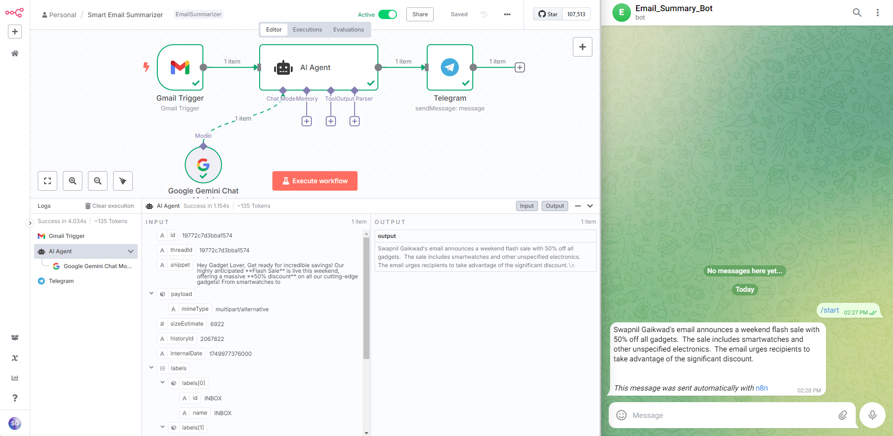

# 📩 Smart Email Summarizer with n8n + Gemini + Telegram

This project uses **n8n**, **Google Gemini AI**, and **Telegram Bot** to automatically summarize incoming emails and send them to Telegram.

---

## ✨ Features

- Auto-trigger on new Gmail emails
- Summarizes content using Gemini AI
- Sends the summary via Telegram
- Optional: Prioritization, formatting, and filtering

---

## 🧰 Tech Stack

- [n8n](https://n8n.io/)
- [Google Gemini AI](https://ai.google.dev/)
- [Gmail API](https://developers.google.com/gmail/api)
- [Telegram Bot API](https://core.telegram.org/bots/api)

---

## 🔧 Prerequisites

- Gmail account (with API access)
- Gemini API key
- Telegram bot & chat ID
- n8n running (local or cloud)

---

## 🚀 Setup Guide

1. Clone this repo  
2. Import `workflow.json` into n8n  
3. Configure Gmail & Gemini API credentials  
4. Set your Telegram Bot Token & Chat ID  
5. Start the workflow

---

## 📸 Demo Screenshot

---

## 📄 License

MIT – Feel free to use, modify, and contribute.
